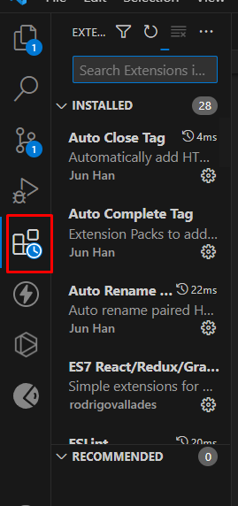
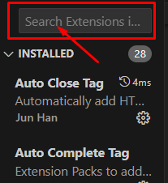
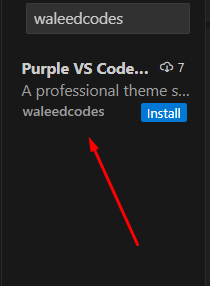
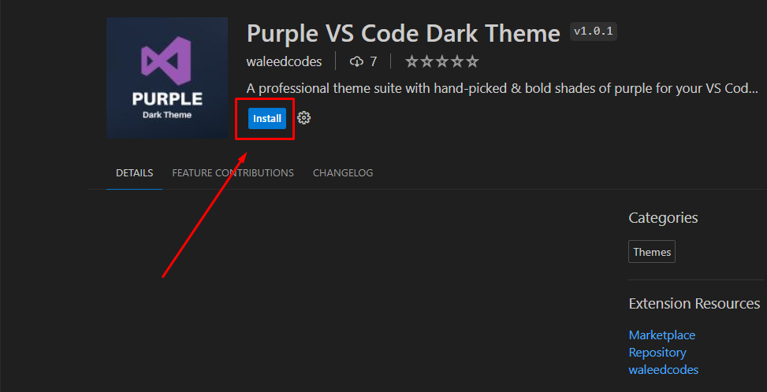
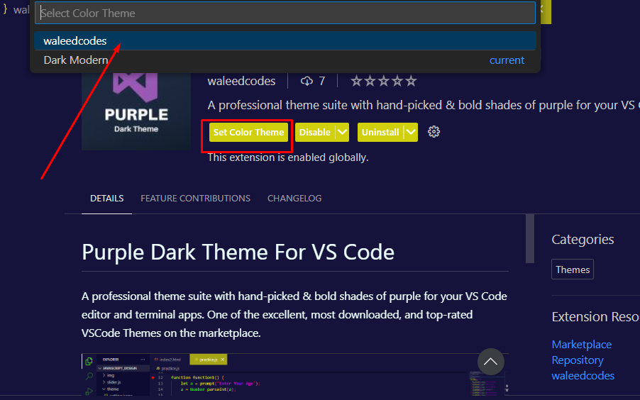

# Purple Dark Theme For VS Code

A professional theme suite with hand-picked & bold shades of purple for your VS Code editor and terminal apps. One of the excellent, most downloaded, and top-rated VSCode Themes on the marketplace.

## Installation

> open Vs Code Editor

 

## Preview Output

 

## Contributors :

1 : Waleed Ishfaq

**Live Preview** : https://marketplace.visualstudio.com/items?itemName=waleedcodes.purple-darktheme
