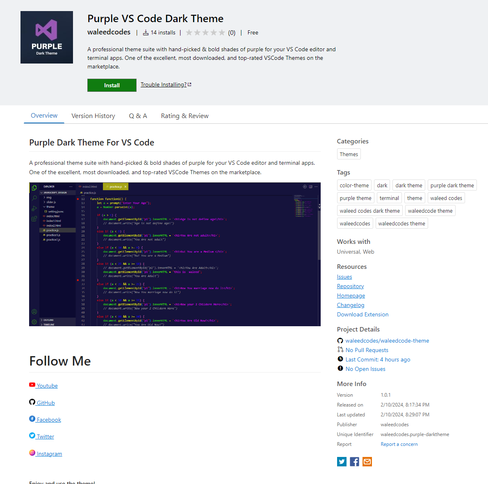

# Purple Dark Theme for VS Code: Immerse Yourself in Creativity 🚀

- **Elegant Aesthetic:** Immerse yourself in a sophisticated coding environment adorned with deep shades of purple, exuding an aura of refinement and elegance.

- **Enhanced Readability:** Enjoy improved readability and reduced eye strain with carefully chosen color contrasts and intuitive syntax highlighting, ensuring that your code is clear and easy to comprehend.

- **Productivity Boost:** Stay focused and productive for longer periods with a visually pleasing yet functional theme that minimizes distractions and maximizes coding efficiency.

- **Creative Inspiration:** Let the calming hues of purple inspire your creativity and innovation, turning every line of code into a stroke of artistic genius.

- **Customizable Experience:** Tailor the theme to your preferences with customizable options, allowing you to adjust the intensity of purple or fine-tune other visual elements to suit your coding style.

- **Community Support:** Join a vibrant community of developers who appreciate the elegance and functionality of the Purple Dark Theme, sharing tips, tricks, and customizations to further enhance your coding experience.

 

**Live Preview** : https://marketplace.visualstudio.com/items?itemName=waleedcodes.purple-darktheme

# Contributors 🧔

- Waleed Ishfaq

# Youtube Channel Link : https://www.youtube.com/@waleedcodes
