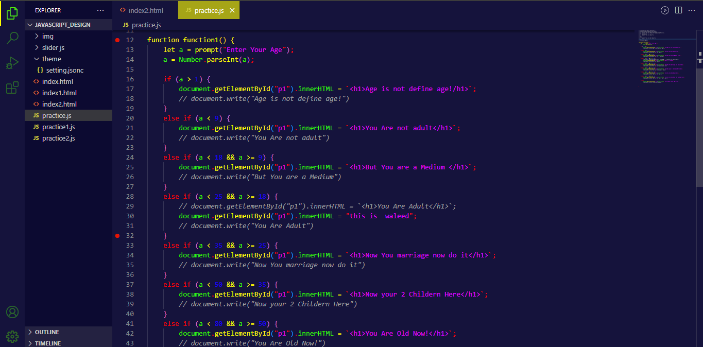

# Purple Dark Theme For VS Code

A professional theme suite with hand-picked & bold shades of purple for your VS Code editor and terminal apps. One of the excellent, most downloaded, and top-rated VSCode Themes on the marketplace.

<h1 style="font-weigth:600; font-size:2rem; ">Follow Me</h1>

<a href="https://www.youtube.com/@waleedcodes" target=_blank rel="noreferrer noopener nofollow"> Youtube</a>

<a href="https://github.com/waleedcodes" target=_blank rel="noreferrer noopener nofollow"> GitHub </a>

<a href="https://www.facebook.com/WaleedIshfaq768" target=_blank rel="noreferrer noopener nofollow"> Facebook </a>

<a href="https://twitter.com/home?lang=en" target=_blank rel="noreferrer noopener nofollow"> Twitter </a>

<a href="https://instagram.com/direct/inbox/" target=_blank rel="noreferrer noopener nofollow"> Instagram </a>

 

**Enjoy and use the theme!**
